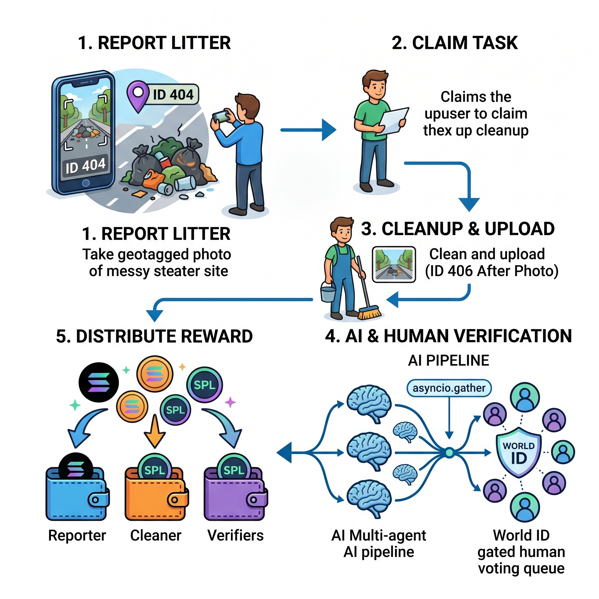
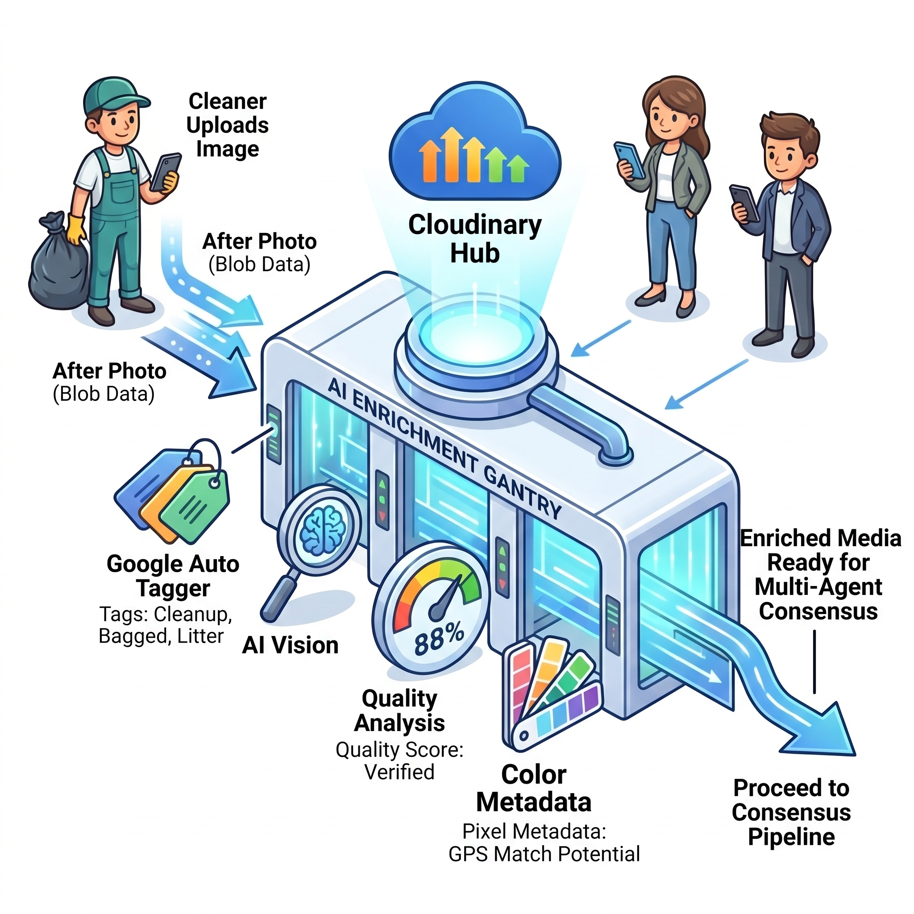
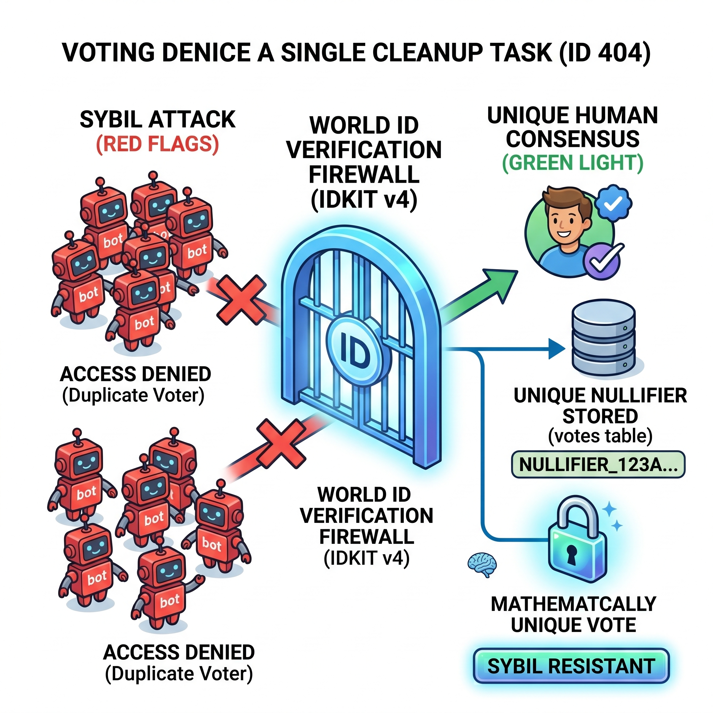
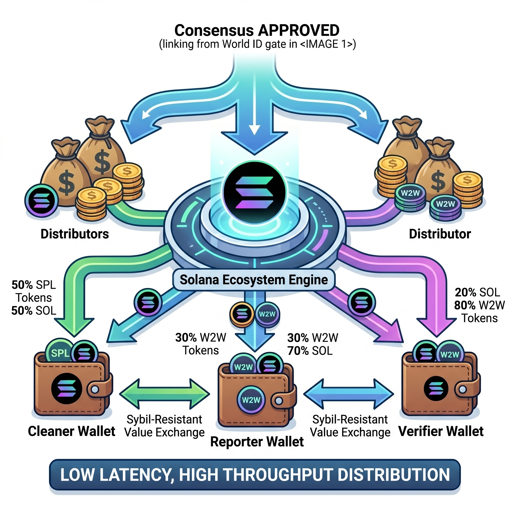
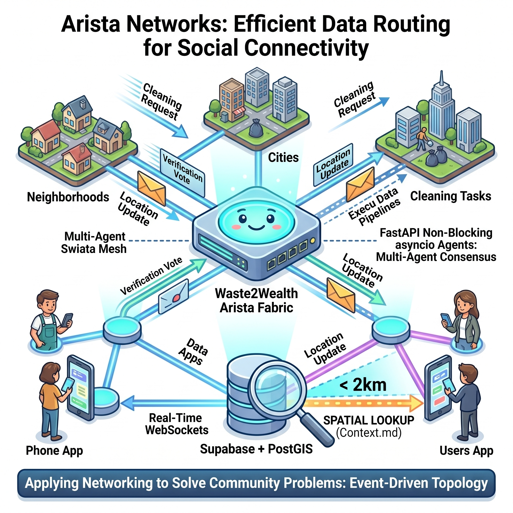

# Waste2Wealth

**Turn litter into Solana rewards.** Report garbage, clean it up, get paid — verified by AI and real human identities.



---

## How it works

| Step | Who | What happens |
|------|-----|--------------|
| Report | Anyone | Photograph litter → GPS-tagged, uploaded to Cloudinary, Gemini tags severity |
| Claim | Cleaner | Browse live map → tap a pin → claim the task |
| Clean | Cleaner | Remove the litter → submit before/after photo |
| Verify | Community | 5 AI agents + World ID-gated human vote confirm the cleanup |
| Earn | Everyone | SOL distributed to reporter, cleaner, and verifiers |

---

## Stack

| Layer | Tech |
|-------|------|
| Mobile | React Native (Expo SDK 52), expo-router, TypeScript |
| Backend | FastAPI (Python 3.12), async throughout |
| Database | Supabase PostgreSQL + PostGIS (GEOGRAPHY columns, GIST index) |
| Auth | Supabase Auth (JWT) + World ID v4 (nullifier model) |
| Media | Cloudinary — upload, CDN, AI Vision Moderation, before/after comparison |
| AI | Gemini 2.5 Flash — litter tagging + 5-agent parallel consensus |
| Blockchain | Solana devnet — Ed25519 keypairs, severity-tiered SOL distribution |
| Realtime | Supabase `postgres_changes` WebSocket |
| Geo | PostGIS `ST_DWithin`, Nominatim reverse geocoding |

---

## AI Verification Pipeline

Every cleanup passes through 5 stages before SOL is released:

1. **Cloudinary AI Vision** — checks the report photo: "Is there actual garbage? Is this AI-generated?" Flagged photos never reach the map.
2. **Gemini litter tagging** — assigns `severity`, `litter_category`, `object_type`, `materials`, `brand`, `item_count` to the report row.
3. **Cloudinary before/after comparison** — dual-source API call on the two photos: "Has the garbage been removed?" Auto-rejects if no.
4. **5-agent Gemini consensus** — Vision AI, Location Guard, Pattern Scanner, Fraud Detector, and Arbiter run in parallel via `asyncio.gather()`. Frontend reveals each verdict with typing animations.
5. **World ID-gated human vote** — one World ID nullifier = one vote per cleanup. No bots, no duplicate accounts.



---

## Anti-Cheat



- Cleaners cannot verify their own reports (`cleaner_id != reporter_id`)
- One World ID = one vote per cleanup, enforced by nullifier stored in the `votes` table
- Cloudinary AI rejects fake or AI-generated report photos before they reach the map
- 6 rotating Gemini API keys prevent rate-limit failures during parallel agent calls

---

## Rewards



Severity is AI-assigned at report time. Payouts scale with real-world impact:

| Severity | Cleaner | Reporter | Verifier (each) |
|----------|---------|----------|-----------------|
| Minor | 0.05 SOL | 0.005 SOL | 0.002 SOL |
| Moderate | 0.10 SOL | 0.010 SOL | 0.005 SOL |
| Major | 0.20 SOL | 0.020 SOL | 0.010 SOL |

Wallets are generated client-side via `@solana/web3.js` and stored in `expo-secure-store` (iOS Keychain). No seed phrases, no setup.

---

## Architecture



- **Non-blocking**: FastAPI `BackgroundTasks` returns HTTP immediately; Cloudinary moderation and Gemini tagging run async
- **Event-driven**: map and verify screens subscribe to Supabase `postgres_changes` WebSocket — zero polling
- **Geo-efficient**: `ST_DWithin` with a GIST-indexed `GEOGRAPHY` column returns only pins within 2km — sub-millisecond at scale

---

## Running locally

### Backend

```bash
cd backend
python -m venv venv && source venv/bin/activate
pip install -r requirements.txt
cp .env.example .env   # fill in keys
uvicorn main:app --reload
```

Required env vars: `SUPABASE_URL`, `SUPABASE_SERVICE_KEY`, `CLOUDINARY_CLOUD_NAME`, `CLOUDINARY_API_KEY`, `CLOUDINARY_API_SECRET`, `GEMINI_API_KEY_1`..`GEMINI_API_KEY_6`, `WORLD_ID_APP_ID`, `WORLD_ID_ACTION`

### Mobile

```bash
npm install
npx expo start
```

Requires an EAS dev build for `expo-camera` and `expo-secure-store` (does not run in Expo Go).

---

## Database

Run migrations in order from `backend/migrations/`. Requires PostGIS enabled on your Supabase project (`CREATE EXTENSION postgis`).

Seed data: `python3 scripts/seed_reports.py --images-dir /path/to/images`
